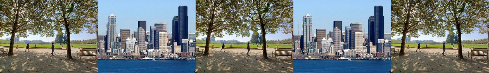

```{r setup, include=FALSE}

library(psrc.travelsurvey)
library(scales)
library(psrcplot)
library(psrccensus)
library(tidyverse)
library(knitr)
library(magick)
library(openxlsx)
library(tidycensus)
library(gridExtra)

options(tinytex.verbose=TRUE)

opts_chunk$set(echo=FALSE, 
               warning=FALSE, 
               message=FALSE,
               fig.align = "center"
               )

install_psrc_fonts()

source("trend_processing.R")
```


{width=100%}

The 2021 regional travel survey collected day-to-day information from households in the central Puget Sound region: how we traveled, where we went, how long it took - even where we chose to live and whether we got home deliveries. This report compares household travel choices in 2021, during COVID-19 conditions to that in the previous years of 2017 and 2019. In some analysis 2017 and 2019 survey samples have been combined to strengthen the statistical validity of the findings by increasing the number of respondents included in the analysis. Learn more at the \href{https://www.psrc.org/our-work/household-travel-survey-program}{\underline{\textcolor{blue}{PSRC household travel survey webpage}}}. You can also \href{https://household-travel-survey-psregcncl.hub.arcgis.com}{\underline{\textcolor{blue}{view the full travel survey dataset here}}}, including 2017, 2019, and 2021 data.


# Regional Growth Centers in Central Puget Sound

Since the early 1990s, the central Puget Sound region has adopted a strategy that focus future population and employment growth in designated \href{https://www.psrc.org/our-work/centers}{\underline{\textcolor{blue}{centers}}} within the region's urban growth area. Currently, there are 29 dense, walkable, mixed-used areas called  \textbf{regional growth centers (RGCs)}, as well as into 9 dense concentrations of employment called  \textbf{regional manufacturing/industrial centers (MICs)}. RGCs are places that higher density and population and employment growth is planned. Based on the most recent findings in 2016, RGCs constitute only 1\% of the region's land area, but contain 5\% share of population and 28\% of employment, as well as 7\% of population growth and 12\% of employment growth. The main function of RGCs is to accommodate significant population and employment growth, as well as to focus regional's investments on housing, services and public transportation to accommodate the large demand that comes with the projected growth.


## RGC Demographics

RGCs, on average, have a much higher percentage of 18- to 34-year-olds compared to the non-RGC regions, as well as fewer children and equal share of seniors. Also, This hints RGCs' attraction to the young workforce, as RGCs offers more rental housing, employment and transit.the percentage of single-person family in RGCs is double the non-RGCs'. The percentage for households with median income lower than $50,000 in the RGC is slightly higher than the non-RGC regions. But, RGCs have smaller household sizes on average. Lastly, as RGCs offer more multimodal travel options, figure 1.d shows that RGCs have a lower vehicle ownership than non-RGCs. In the next section, we will look more closely into the differences in travel behaviors of residents living in RGCs and non-RGC regions.


```{r plot_demo_rgc, fig.cap= "Regional Growth Center Demographics (Source: U.S. Census Bureau - American Community Survey, 2021 Block Group Estimates)", fig.subcap=c('Age', 'Income', 'Household Size', 'Vehicle Ownership'), fig.ncol = 2, out.width = "50%",out.height = "150%"}

plot_age21
plot_income
plot_hhsize21
plot_veh21_rgc
```
```{r plot_demo_mu, fig.cap= "Metro and Urban Regional Growth Center Demographics (Source: U.S. Census Bureau - American Community Survey, 2021 Block Group Estimates)", fig.subcap=c('Age', 'Income', 'Household Size', 'Vehicle Ownership'), fig.ncol = 2, out.width = "50%",out.height = "150%"}

plot_age21_mu
plot_income_mu
plot_hhsize21_mu
plot_veh21_rgc_mu
```


```{r, fig.height=6, fig.width = 7, include=FALSE}
grid.arrange(plot_age+ theme(legend.position="none"),
             plot_hhsize21+ theme(legend.position="none"),
             plot_income+ theme(legend.position="none"),
             plot_veh21_rgc+ theme(legend.position="none"), 
             demo_legend, 
             ncol=2, nrow = 3, 
             layout_matrix = rbind(c(1,2), 
                                   c(3,4),
                                   c(5,5)),
             widths = c(5.5, 3), heights = c(2.5,2.5, 0.2))

plot_hhsize + labs(caption = "U.S. Census Bureau - American Community Survey, 2017-2021 Census Tract Estimates.")

plot_income + labs(caption = "U.S. Census Bureau - American Community Survey, 2017-2021 Census Tract Estimates.")

plot_veh_own + labs(caption = "U.S. Census Bureau - American Community Survey, 2017-2021 Census Tract Estimates.")
```


## Travel Behavior

To support projected growth in RGCs, the region's plans call for an efficient multimodal transportation system that increases accessibility in the region. It is anticipated that the RGCs will be connected with high-capacity transit. In addition, a more efficient urban environment will be created to provide multiple travel choices, including cars, transit, walking, biking and ride-sharing. 

This report applied 2017, 2019 and 2021 Household Travel Survey data to measure the travel behaviors of residents in RGCs and how their travel behavior is different than residents in non-RGC areas.

### Mode shares

In figure 2, RGCs have significantly less driving trips, which includes trips traveling with SOV and HOV, in 2021 compared to non-RGC regions. The reduced driving trips in RGCs are replaced by more transit and walking/biking trips. This matches with the residents in RGCs having lower vehicle ownership

```{r mode share, fig.cap="Mode Share (Source: PSRC 2021 Household Travel Survey)", fig.height=2, fig.width = 5}
mode_rgc
```

### Change in mode shares
Although the mode share 

```{r, fig.height = 3, fig.width = 4, fig.cap= "Change in mode share in RGCs (Source: PSRC 2017/2019/2021 Household Travel Survey)"}
mode_change_rgc

# TT <- "Change in mode share in metro and urban RGCs \n(2021 compared to 2017/2019 HHTS)"
# ggplot(mode_change_metro, aes(x=mode_simple2, y=share_change, fill=urban_metro)) +
#   geom_col(position = "dodge")+
#   geom_errorbar(aes(ymin=share_change-share_moe_change, ymax=share_change+share_moe_change),
#                           width=0.2, position = position_dodge(0.9)) +
#   scale_y_continuous(labels=percent) +
#   scale_fill_discrete_psrc ("gnbopgy_5")+
#   ggtitle(TT)+
#   psrc_style2(text_size = 2)
```

### Trip travel time and trip distance

```{r, fig.height = 4, fig.width = 4.65, fig.cap= "Average Travel time and trip distance (Source: PSRC 2021 Household Travel Survey)"}

time_dist_rgc

```

### walk and transit frequency
```{r, fig.height = 3, fig.width = 4, fig.cap= "Transit Frequency (Source: PSRC 2021 Household Travel Survey)"}
freq_transit
```


```{r, fig.height = 3, fig.width = 4, fig.cap= "Walking Frequency (Source: PSRC 2021 Household Travel Survey)"}
freq_walk

```


\subsection{Conclusion}

People were walking and biking more in 2021 than in previous years, but using transit less. COVID-19 conditions contributed to this substantial shift in behavior across most demographic groups. The 2023 household travel survey will show whether these patterns continue.
\end{flushright}
