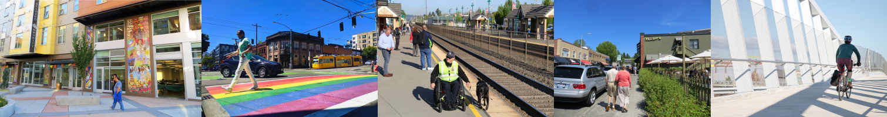

\setmainfont{Poppins}

# Trends in Walking and Biking 
```{r setup, include=FALSE}
library(psrcplot)
library(psrccensus)
library(tidyverse)
library(knitr)
library(magick)
library(openxlsx)
library(htmlwidgets)
output_path='C:/GitHub/travel-studies/2021/trend-stories/bike-ped/'
options(tinytex.verbose=TRUE)
# Create Image 
image1 <- image_read("plaza_roberto.png")
image2 <- image_read("pride_pedestrian.jpg")
image3 <- image_read("puyallup_transit.jpg")
image4<-  image_read("hectors-walking.jpg")
image5<- image_read("northgate_cyclist.jpg")
input <- c(image_scale(image1, "x200"), image_scale(image2, "x200"), image_scale(image3, "x200"),  image_scale(image4, "x200"),  image_scale(image5, "x200"))
walking_image_header <- image_append(input)
image_write(walking_image_header, path="walking_image_header.png", format="png")
install_psrc_fonts()
walking_image_header
```
{width=100%}
\begin{flushleft}
The 2021 household travel survey collected day-to-day information from households in the central Puget Sound region, such as how we traveled, where we went, how long it took—even where we chose to live and whether we got home deliveries. This report compares household travel choices in 2021, during COVID-19 to previous survey years of 2017 and 2019. Learn more at the \href{https://www.psrc.org/our-work/household-travel-survey-program}{\underline{\textcolor{blue}{household travel survey webpage}}}. You can also \href{https://household-travel-survey-psregcncl.hub.arcgis.com}{\underline{\textcolor{blue}{view the full travel survey dataset here}}}, including 2017, 2019 and 2021 data.
\end{flushleft}

## People walked more and used transit less in 2021
\begin{flushleft}
In 2021, the regional walk mode share was 15\% and 
the regional bike mode share was 1\%. Compared to previous surveys, 
walking and biking trips increased and transit trips decreased.  
\end{flushleft}


```{r, echo=FALSE, results=TRUE,  fig.dim=c(6,4)}
wb <- createWorkbook()
xlsx_file <- "bike_ped_hhts_2021.xlsx"

```


```{r overallmodeshare, echo=FALSE, results=TRUE,  fig.dim=c(6,3), fig.dim=c(6,3) }

if(file.exists(paste0(output_path, "/trips_by_mode.csv"))){
  
  trips_by_mode<-read.csv(paste0(output_path, '/trips_by_mode.csv'))
}else{
  # pull the data from Elmer, group, and organize it, write to csv
  source('bike-ped-data-processing-new-weights.R')
  trips_by_mode<-read.csv(paste0(output_path, '/trips_by_mode.csv'))
}

trips_by_mode_no_drive<-trips_by_mode%>%filter(!mode_simple %in% c('Drive', 'Other'))

trips_by_mode_trend<-static_column_chart(t=trips_by_mode_no_drive, x='mode_simple', y='share', fill='year', moe='share_moe', est='percent', color = "pgnobgy_5", title="Non-Driving Trip Mode Shares")

trips_by_mode_trend

trips_by_mode_trend_int<-interactive_column_chart(t=trips_by_mode_no_drive, x='mode_simple', y='share', fill='year', moe='share_moe', est='percent', color = "pgnobgy_5", title="Non-Driving Trip Mode Shares")

saveWidget(trips_by_mode_trend_int, 
           file=paste0(output_path,'/bike_ped_interactive_plots/trips_by_mode_no_drive.html'))

#trips_by_mode_trend_int<-create_column_chart(t=trips_by_mode_no_drive, x='mode_simple', y='share', f='year', moe='share_moe', est='percent', color = "pgnobgy_5", title="Non-Driving Trip Mode Shares", interactive='yes')

#%>%layout(xaxis=list(title='Trip Mode'),yaxis=list(title='Percent of All Trips') )

#saveWidget(trips_by_mode_trend_int, file=paste0(output_path, '/trips_by_mode.html'))

addWorksheet(wb = wb, sheetName = 'trips_by_mode', gridLines = FALSE)
writeDataTable(wb = wb, sheet = 'trips_by_mode', x = trips_by_mode_no_drive)

```

\begin{flushleft}
The walk trip mode share was over 30\% in 2021 for social,
recreational, and meal trips. A greater proportion of trips was made
for these purposes in 2021 when compared to 2017/2019 survey responses.  
Driving remained around 80\% of trips, consistent with previous years. The 2017 and 2019 survey samples have been combined in this analysis to strengthen the statistical validity of the findings by increasing the number of respondents in each calculation. Lines above the columns in each chart indicate the margin of error.
\end{flushleft}

### More social-recreation Trips, Fewer work and school trips
\begin{flushleft}
The average number of trips per day per person decreased modestly from 4.4 trips in 2017/2019 to 4.1 trips. People took more social-recreation trips and fewer work and school trips.
\end{flushleft}


```{r purpose, echo=FALSE, results=TRUE,  fig.dim=c(6,4)}
trips_by_purpose<-read.csv(paste0(output_path, '/trips_by_purpose.csv'))

trips_by_purpose_trend<-static_bar_chart(t=trips_by_purpose , y='simple_purpose',x='share', fill='survey', moe='share_moe',est ='percent', color="pgnobgy_5",  title= 'Percent of Trips by Purpose')


addWorksheet(wb = wb, sheetName = 'trips_by_purpose', gridLines = FALSE)
writeDataTable(wb = wb, sheet = 'trips_by_purpose', x = trips_by_purpose)
trips_by_purpose_trend
```


### A greater share of social-recreation trips were made by walking in 2021
\begin{flushleft}
Walking mode shares increased for social, recreation, and meal purposes but decreased for work and school in 2021, as compared to 2017/2019.

In 2021, walking accounted for about one-third of social, recreation and meal-related trips up from a fourth of these types of trips in 2017/2019. 
\end{flushleft}

```{r walkpurpose, echo=FALSE, results=TRUE,  fig.dim=c(6,4)}
trips_by_purpose_walk<-read.csv(paste0(output_path, '/trips_by_purpose_walk.csv'))

trips_by_purpose_walk_trend<-static_bar_chart(t=trips_by_purpose_walk , y='simple_purpose',x='share', fill='survey', moe='share_moe', est='percent', color="pgnobgy_5", title='Walk Mode Share by Purpose')


trips_by_purpose_walk_trend
addWorksheet(wb = wb, sheetName = 'trips_by_purpose_walk', gridLines = FALSE)
writeDataTable(wb = wb, sheet = 'trips_by_purpose_walk', x = trips_by_purpose_walk)

```


### 75% of transit trips were accessed by walking
\begin{flushleft}
Approximately 75\% of all transit trips were accessed by walk, jog or wheelchair.  Access by biking accounted for less than 5\% of trips to transit in both years.  The remaining transit trips were accessed by several other modes, including driving oneself and getting dropped off.
\end{flushleft}
```{r transit-access, echo=FALSE, results=TRUE,  fig.dim=c(6,4)}
transit_access_mode<-read.csv(paste0(output_path, '/transit_access.csv'))
transit_access_chart<-static_column_chart(t=transit_access_mode, x='mode_acc_walk', y='share', fill='year', moe='share_moe', est='percent',color="pgnobgy_5", title='Transit Access Mode')
addWorksheet(wb = wb, sheetName = 'transit_access_mode', gridLines = FALSE)
writeDataTable(wb = wb, sheet = 'transit_access_mode', x = transit_access_mode)
transit_access_chart
```

### More people going for walks and bike rides
\begin{flushleft}
Around 70\% of people reported going for walks even before COVID-19. During COVID-19 the share of people who reported going for walks increased about 10\% to 80\% of adults. 

In 2021, the highest share of people reported walking two to four days a week, in 2017/2019, the highest share of people reported never walking. 
\end{flushleft}
\begin{flushleft}
People biked a little more frequently in 2021 than in 2017/2019. More people in the region biked sometimes, but less than monthly in 2021. 
\end{flushleft}


```{r walk-freq, echo=FALSE, results=TRUE,  fig.dim=c(6,4)}
walk_freq<-read.csv(paste0(output_path, '/walk_frequency.csv'))
walk_freq_chart<-static_bar_chart(t=walk_freq , y='mode_freq_3', x='share', fill='survey', moe='share_moe', est='percent',color="pgnobgy_5", title ='Share of People Going for Walks')
walk_freq_chart
addWorksheet(wb = wb, sheetName = 'walk_freq', gridLines = FALSE)
writeDataTable(wb = wb, sheet = 'walk_freq', x = walk_freq)

walkfreq_trend_int<-interactive_bar_chart(t=walk_freq, y='mode_freq_3', x='share', fill='survey', est='percent',color="pgnobgy_5", title ='Share of People Going for Walks')

saveWidget(walkfreq_trend_int, 
           file=paste0(output_path,'/bike_ped_interactive_plots/walkfreq_trend_int.html'))

```


```{r bike-freq, echo=FALSE, results=TRUE,  fig.dim=c(6,4)}
bike_freq<-read.csv(paste0(output_path, '/bike_frequency.csv'))
bike_freq_chart<-static_bar_chart(t=bike_freq , y='mode_freq_2', x='share', fill='survey', moe='share_moe', est='percent',color="pgnobgy_5", title = 'Share of People Going for Bike Rides')
bike_freq_chart
addWorksheet(wb = wb, sheetName = 'bike_freq', gridLines = FALSE)
writeDataTable(wb = wb, sheet = 'bike_freq', x = bike_freq)
```

## Walking trends for by home location, income, and race

\begin{flushleft}
As walking rates were up in 2021, we also explored:
  \begin{itemize}
\item How much were different demographic groups walking as percent of all their trips in 2021?
  \item How did people's walk mode shares change from 2017 to 2021?
\end{itemize}

\textbf{Regional Growth Centers}

People who lived in regional growth centers walked on about 32\% their trips. By comparison, to people who lived outside of regional growth centers who walk on only 13\% of their trips. Both groups increased their walking mode shares from 2017/2019 to 2021.

\end{flushleft}

```{r, echo=FALSE, results=TRUE,  fig.dim=c(6,4)}
rgc_walk_mode<-read.csv(paste0(output_path, 'final_home_is_rgcwalk_mode_share.csv'))
rgc_walk_mode_chart<-static_bar_chart(t=rgc_walk_mode , y='final_home_is_rgc', x='share', f='survey', moe='share_moe', est='percent', color="pgnobgy_5", title = 'Walking Trip Shares by Home Location')
rgc_walk_mode_chart

addWorksheet(wb = wb, sheetName = 'rgc_walk_mode', gridLines = FALSE)
writeDataTable(wb = wb, sheet = 'rgc_walk_mode', x = rgc_walk_mode)


```
\begin{flushleft}
\textbf{Walking by vehicle ownership}

People living in regional growth centers may walk more than others because they own fewer cars. People with no vehicles in their household walked on nearly 50\% of their trips. People who have vehicle in their household walking on 13\% of their trips.

\end{flushleft}

```{r, echo=FALSE, results=TRUE,  fig.dim=c(6,4)}
veh_walk_mode<-read.csv(paste0(output_path, 'NoVehicleswalk_mode_share.csv'))
veh_walk_mode_chart<-static_column_chart(t=veh_walk_mode , x='NoVehicles', y='share', f='survey', moe='share_moe', est='percent', color="pgnobgy_5", title='Walking Trip Mode Shares by Household Vehicle Ownership')
veh_walk_mode_chart

addWorksheet(wb = wb, sheetName = 'veh_walk_mode', gridLines = FALSE)
writeDataTable(wb = wb, sheet = 'veh_walk_mode', x = veh_walk_mode)


```
\begin{flushleft}
\textbf{Walking by race and ethnicity}

In 2021, all racial groups had higher walking shares than in 2017/2019. Interpretation of variation in mode share across the racial groups is not possible because of the wide margins of error.

\end{flushleft}

```{r, echo=FALSE, results=TRUE,  fig.dim=c(6,4)}
race_walk_mode<-read.csv(paste0(output_path, 'race_eth_broadwalk_mode_share.csv'))

race_walk_mode_chart<-static_bar_chart(t=race_walk_mode , y='race_eth_broad', x='share', f='survey', moe='share_moe', est='percent', color="pgnobgy_5", title='Walking Trip Mode Shares by Race and Ethnicity')+scale_x_discrete(limits=rev)
race_walk_mode_chart

addWorksheet(wb = wb, sheetName = 'race_walk_mode', gridLines = FALSE)
writeDataTable(wb = wb, sheet = 'race_walk_mode', x = race_walk_mode)


```

### Going for walks and bike rides
\begin{flushleft}
The previous analysis showed how people made a higher percent of their trips by walking in 2021 than before.  The travel survey examines recreational walking and biking by asking people how frequently they go for a walk or a bike ride. The 2021 survey results showed all of the following types of people walked more frequently:
  \begin{itemize}
\item all racial groups
\item all income groups
\item all age groups
\item living in all four counties
\end{itemize}

People of all racial groups also went for bike rides more frequently in 2021 than in 2017/2019.
\end{flushleft}

```{r, echo=FALSE, results=TRUE,  fig.dim=c(6,4)}
saveWorkbook(wb=wb, file=xlsx_file, overwrite = TRUE)

```

\subsection{Conclusion}
\begin{flushleft}
People were walking and biking more in 2021 than in previous years but using transit less. COVID-19 conditions contributed to this substantial shift in behavior across most demographic groups. The 2023 household travel survey will show whether these patterns continue.
\end{flushleft}

